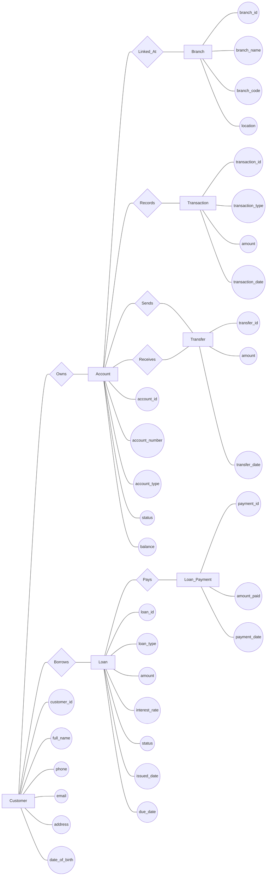

# Bank Database ER Diagram (Chen Style)

## Notes

- This is a Chen-style visual layout to match your example.
- For implementation, keep using the normalized relational design in `Bank_database_system.md`.
