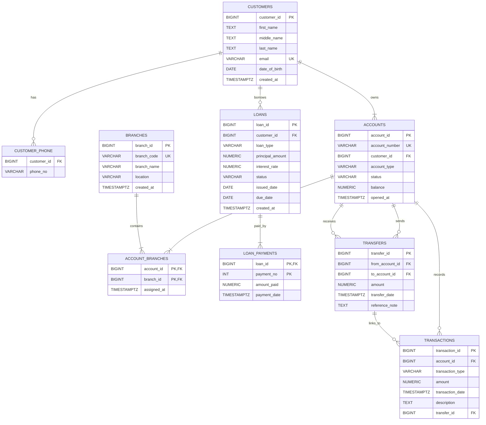

# Bank Database ER Diagram

## Notes

- Mermaid keeps this version lightweight for Markdown preview.
- Use `ER_diagram_chen.svg` or `ER_diagram_chen_strict.svg` when you need full Chen/EER notation.
- `LOAN_PAYMENTS` uses the composite key `(loan_id, payment_no)` to represent weak-entity behavior.
