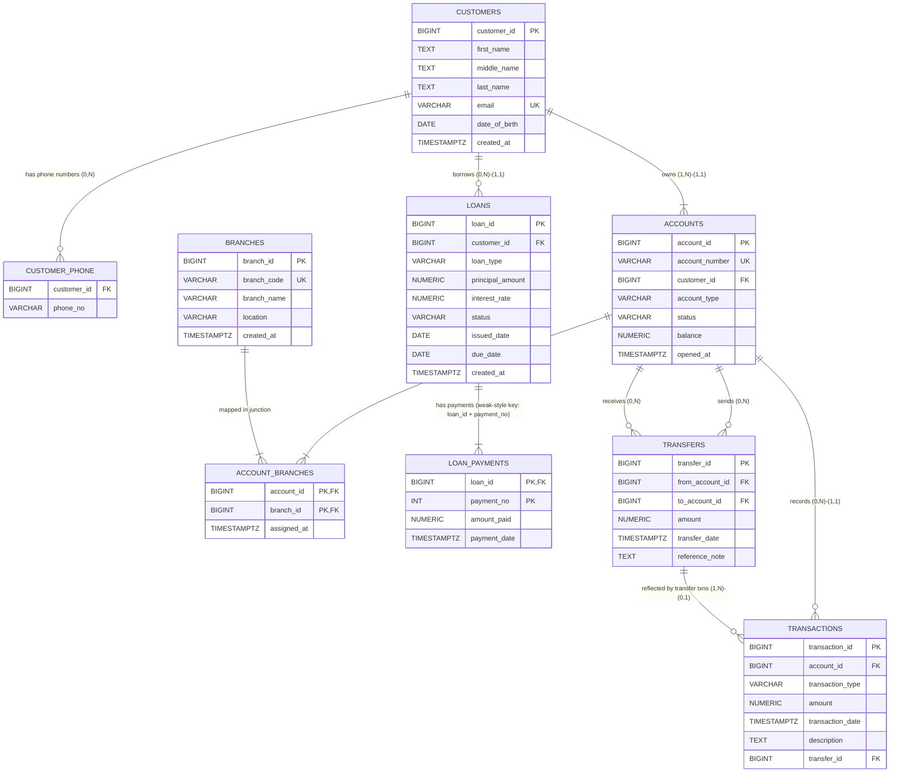

# Bank Database ER Diagram (Mermaid Compatible)

## Notes

- This file is fully Mermaid-compatible for Markdown preview.
- Mermaid `erDiagram` does not support full Chen symbols (double oval, double rectangle, dashed underline) directly.
- `LOAN_PAYMENTS` is modeled with composite key `(loan_id, payment_no)` to reflect weak-entity behavior logically.
