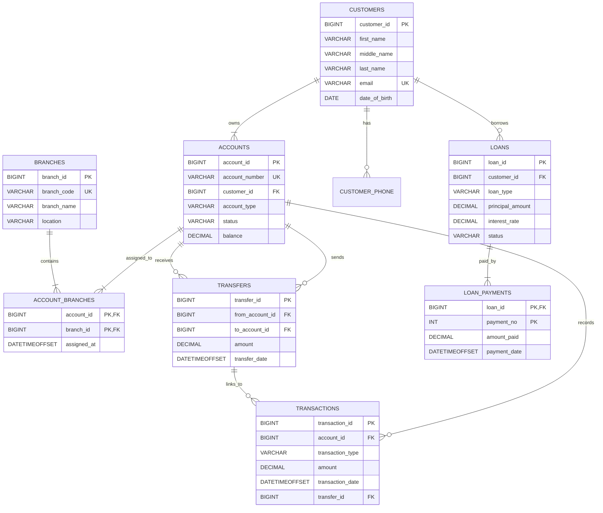

# SQL Server / SSMS Cheat Sheet

This document is a SQL Server friendly Markdown reference for use with SQL Server Management Studio (SSMS). Examples use T-SQL syntax and avoid non-SQL Server keywords such as `LIMIT`.

## SSMS Basics

- Use `GO` to separate batches in SSMS. `GO` is an SSMS/sqlcmd batch separator, not a SQL command stored in the database engine.
- Use `TOP (n)` instead of `LIMIT`.
- Use square brackets only when an identifier has spaces, reserved words, or special characters: `[Order]`, `[User Name]`.
- Prefer schema-qualified object names such as `dbo.customers`.
- End statements with semicolons, especially before CTEs and `MERGE`.

```sql
USE bank_database;
GO

SELECT TOP (10) *
FROM dbo.customers
ORDER BY customer_id;
```

## SELECT

`SELECT` reads data from one or more tables.

```sql
SELECT *
FROM dbo.customers;

SELECT first_name, last_name, email
FROM dbo.customers;
```

Use `WHERE` to filter rows.

```sql
SELECT account_number, account_type, balance
FROM dbo.accounts
WHERE status = 'active';
```

Use `ORDER BY` to sort.

```sql
SELECT account_number, balance
FROM dbo.accounts
ORDER BY balance DESC;
```

Use `TOP` for a limited result set.

```sql
SELECT TOP (5) account_number, balance
FROM dbo.accounts
ORDER BY balance DESC;
```

Use `DISTINCT` for unique values.

```sql
SELECT DISTINCT account_type
FROM dbo.accounts;
```

## INSERT

`INSERT` adds rows to a table.

```sql
INSERT INTO dbo.customers
    (first_name, middle_name, last_name, email, city, state, date_of_birth)
VALUES
    ('John', NULL, 'Doe', 'john.doe@example.com', 'Addis Ababa', 'AA', '1995-04-12');
```

Insert multiple rows:

```sql
INSERT INTO dbo.branches (branch_name, location, branch_code)
VALUES
    ('Main Branch', 'Downtown', 'BR-001'),
    ('North Branch', 'North District', 'BR-002');
```

Insert from another query:

```sql
INSERT INTO dbo.customer_phone (customer_id, phone_no)
SELECT customer_id, '+251911000000'
FROM dbo.customers
WHERE email = 'john.doe@example.com';
```

## UPDATE

`UPDATE` changes existing rows. Always test the `WHERE` clause first with a `SELECT`.

```sql
UPDATE dbo.accounts
SET status = 'frozen'
WHERE account_id = 10;
```

Update from another table:

```sql
UPDATE a
SET a.status = 'closed'
FROM dbo.accounts AS a
WHERE a.balance = 0
  AND a.status = 'active';
```

## DELETE

`DELETE` removes rows while preserving the table structure.

```sql
DELETE FROM dbo.customer_phone
WHERE customer_id = 1
  AND phone_no = '+251911000000';
```

For safety:

```sql
BEGIN TRANSACTION;

DELETE FROM dbo.customer_phone
WHERE customer_id = 1;

-- COMMIT TRANSACTION;
-- ROLLBACK TRANSACTION;
```

## CREATE TABLE

`CREATE TABLE` defines a new table, columns, data types, and constraints.

```sql
CREATE TABLE dbo.example_table (
    example_id BIGINT IDENTITY(1,1) NOT NULL,
    example_name VARCHAR(100) NOT NULL,
    created_at DATETIMEOFFSET NOT NULL
        CONSTRAINT DF_example_table_created_at DEFAULT SYSDATETIMEOFFSET(),
    CONSTRAINT PK_example_table PRIMARY KEY (example_id)
);
```

## DROP, ALTER, and TRUNCATE

`DROP` removes an object.

```sql
DROP TABLE IF EXISTS dbo.example_table;
```

`ALTER` changes an existing object.

```sql
ALTER TABLE dbo.customers
ADD national_id VARCHAR(50) NULL;
```

`TRUNCATE` removes all rows quickly and resets identity values, but it cannot run if the table is referenced by a foreign key.

```sql
TRUNCATE TABLE dbo.example_table;
```

## Constraints

### PRIMARY KEY

A primary key uniquely identifies each row and cannot be null.

```sql
CONSTRAINT PK_customers PRIMARY KEY (customer_id)
```

### FOREIGN KEY

A foreign key enforces a relationship to another table.

```sql
CONSTRAINT FK_accounts_customer
    FOREIGN KEY (customer_id) REFERENCES dbo.customers(customer_id)
```

### UNIQUE

`UNIQUE` prevents duplicate values.

```sql
CONSTRAINT UQ_customers_email UNIQUE (email)
```

### NOT NULL

`NOT NULL` requires a value.

```sql
email VARCHAR(255) NOT NULL
```

### CHECK

`CHECK` enforces a rule on column values.

```sql
CONSTRAINT CK_accounts_balance CHECK (balance >= 0)
```

### DEFAULT

`DEFAULT` supplies a value when none is provided.

```sql
status VARCHAR(20) NOT NULL
    CONSTRAINT DF_accounts_status DEFAULT 'active'
```

## Joins

### INNER JOIN

Returns matching rows from both tables.

```sql
SELECT c.first_name, c.last_name, a.account_number
FROM dbo.customers AS c
INNER JOIN dbo.accounts AS a
    ON a.customer_id = c.customer_id;
```

### LEFT JOIN

Returns all rows from the left table and matching rows from the right table.

```sql
SELECT c.customer_id, c.first_name, a.account_number
FROM dbo.customers AS c
LEFT JOIN dbo.accounts AS a
    ON a.customer_id = c.customer_id;
```

### RIGHT JOIN

Returns all rows from the right table and matching rows from the left table. In most designs, rewrite as a `LEFT JOIN` by swapping table order for readability.

```sql
SELECT c.first_name, a.account_number
FROM dbo.customers AS c
RIGHT JOIN dbo.accounts AS a
    ON a.customer_id = c.customer_id;
```

### FULL OUTER JOIN

Returns rows that match plus nonmatching rows from both sides.

```sql
SELECT c.customer_id, a.account_id
FROM dbo.customers AS c
FULL OUTER JOIN dbo.accounts AS a
    ON a.customer_id = c.customer_id;
```

### CROSS JOIN

Returns every combination of rows.

```sql
SELECT c.customer_id, b.branch_id
FROM dbo.customers AS c
CROSS JOIN dbo.branches AS b;
```

### SELF JOIN

Joins a table to itself.

```sql
SELECT a1.account_id AS first_account_id,
       a2.account_id AS second_account_id,
       a1.customer_id
FROM dbo.accounts AS a1
INNER JOIN dbo.accounts AS a2
    ON a1.customer_id = a2.customer_id
   AND a1.account_id < a2.account_id;
```

## UNION

`UNION` combines result sets and removes duplicates. `UNION ALL` keeps duplicates and is usually faster.

```sql
SELECT from_account_id AS account_id
FROM dbo.transfers
UNION
SELECT to_account_id AS account_id
FROM dbo.transfers;
```

## Aggregate Functions

Common aggregate functions are `COUNT`, `SUM`, `AVG`, `MIN`, and `MAX`.

```sql
SELECT
    account_type,
    COUNT(*) AS account_count,
    SUM(balance) AS total_balance,
    AVG(balance) AS average_balance,
    MIN(balance) AS minimum_balance,
    MAX(balance) AS maximum_balance
FROM dbo.accounts
GROUP BY account_type;
```

## GROUP BY and HAVING

`GROUP BY` forms groups. `HAVING` filters grouped results.

```sql
SELECT customer_id, COUNT(*) AS account_count
FROM dbo.accounts
GROUP BY customer_id
HAVING COUNT(*) > 1;
```

Use `WHERE` before grouping and `HAVING` after grouping.

```sql
SELECT account_type, COUNT(*) AS active_accounts
FROM dbo.accounts
WHERE status = 'active'
GROUP BY account_type
HAVING COUNT(*) >= 2;
```

## COALESCE

`COALESCE` returns the first non-null expression.

```sql
SELECT
    first_name,
    COALESCE(middle_name, '') AS middle_name,
    last_name
FROM dbo.customers;
```

## CASE

`CASE` adds conditional logic.

```sql
SELECT
    account_number,
    balance,
    CASE
        WHEN balance >= 100000 THEN 'high'
        WHEN balance >= 10000 THEN 'medium'
        ELSE 'low'
    END AS balance_band
FROM dbo.accounts;
```

## Subqueries

A subquery is a query inside another query.

```sql
SELECT account_number, balance
FROM dbo.accounts
WHERE balance > (
    SELECT AVG(balance)
    FROM dbo.accounts
);
```

Use `EXISTS` when checking for related rows.

```sql
SELECT c.customer_id, c.first_name, c.last_name
FROM dbo.customers AS c
WHERE EXISTS (
    SELECT 1
    FROM dbo.loans AS l
    WHERE l.customer_id = c.customer_id
);
```

## Common Table Expressions

A CTE improves readability by naming a temporary result set for one following statement.

```sql
;WITH customer_balances AS (
    SELECT customer_id, SUM(balance) AS total_balance
    FROM dbo.accounts
    GROUP BY customer_id
)
SELECT c.first_name, c.last_name, cb.total_balance
FROM customer_balances AS cb
INNER JOIN dbo.customers AS c
    ON c.customer_id = cb.customer_id;
```

Recursive CTE shape:

```sql
;WITH numbers AS (
    SELECT 1 AS n
    UNION ALL
    SELECT n + 1
    FROM numbers
    WHERE n < 10
)
SELECT n
FROM numbers
OPTION (MAXRECURSION 100);
```

## Window Functions

Window functions calculate values across a set of related rows without collapsing the result set.

```sql
SELECT
    account_id,
    transaction_date,
    amount,
    SUM(amount) OVER (
        PARTITION BY account_id
        ORDER BY transaction_date, transaction_id
        ROWS BETWEEN UNBOUNDED PRECEDING AND CURRENT ROW
    ) AS running_amount
FROM dbo.transactions;
```

Ranking:

```sql
SELECT
    account_id,
    balance,
    ROW_NUMBER() OVER (ORDER BY balance DESC) AS balance_rank
FROM dbo.accounts;
```

## Views

A view stores a reusable query.

```sql
CREATE OR ALTER VIEW dbo.v_customer_accounts
AS
SELECT
    c.customer_id,
    c.first_name,
    c.last_name,
    a.account_id,
    a.account_number,
    a.account_type,
    a.status,
    a.balance
FROM dbo.customers AS c
INNER JOIN dbo.accounts AS a
    ON a.customer_id = c.customer_id;
GO
```

## Stored Procedures

A stored procedure stores reusable database logic.

```sql
CREATE OR ALTER PROCEDURE dbo.usp_GetCustomerAccounts
    @CustomerId BIGINT
AS
BEGIN
    SET NOCOUNT ON;

    SELECT account_id, account_number, account_type, status, balance
    FROM dbo.accounts
    WHERE customer_id = @CustomerId
    ORDER BY opened_at DESC;
END;
GO

EXEC dbo.usp_GetCustomerAccounts @CustomerId = 1;
```

## Functions

Scalar function:

```sql
CREATE OR ALTER FUNCTION dbo.ufn_FullName
(
    @FirstName VARCHAR(100),
    @MiddleName VARCHAR(100),
    @LastName VARCHAR(100)
)
RETURNS VARCHAR(305)
AS
BEGIN
    RETURN CONCAT(@FirstName, ' ', COALESCE(@MiddleName + ' ', ''), @LastName);
END;
GO
```

Inline table-valued function:

```sql
CREATE OR ALTER FUNCTION dbo.ufn_AccountsByStatus
(
    @Status VARCHAR(20)
)
RETURNS TABLE
AS
RETURN
(
    SELECT account_id, account_number, customer_id, balance
    FROM dbo.accounts
    WHERE status = @Status
);
GO
```

## Indexes

Indexes speed up reads but add overhead to writes.

```sql
CREATE INDEX IX_accounts_customer_id
ON dbo.accounts (customer_id);

CREATE INDEX IX_transactions_account_date
ON dbo.transactions (account_id, transaction_date DESC);
```

Useful index guidelines:

- Index foreign key columns used in joins.
- Index columns commonly used in `WHERE`, `JOIN`, `ORDER BY`, and grouping operations.
- Avoid indexing every column.
- Prefer selective columns, such as email or account number, over low-cardinality columns alone, such as status.
- Consider included columns for covering queries.

```sql
CREATE INDEX IX_accounts_customer_status
ON dbo.accounts (customer_id, status)
INCLUDE (account_number, balance);
```

## Transactions and Concurrency

A transaction groups statements so they succeed or fail together.

```sql
BEGIN TRY
    BEGIN TRANSACTION;

    UPDATE dbo.accounts
    SET balance = balance - 500.00
    WHERE account_id = 1;

    UPDATE dbo.accounts
    SET balance = balance + 500.00
    WHERE account_id = 2;

    COMMIT TRANSACTION;
END TRY
BEGIN CATCH
    IF @@TRANCOUNT > 0
        ROLLBACK TRANSACTION;

    THROW;
END CATCH;
```

Common isolation levels:

- `READ UNCOMMITTED`: can read uncommitted data.
- `READ COMMITTED`: default in SQL Server; avoids dirty reads.
- `REPEATABLE READ`: prevents other transactions from changing rows already read.
- `SERIALIZABLE`: strongest standard isolation; protects key ranges.
- `SNAPSHOT`: reads row versions when enabled.

```sql
SET TRANSACTION ISOLATION LEVEL READ COMMITTED;
```

## Triggers

A trigger runs automatically after or instead of a data change.

```sql
CREATE OR ALTER TRIGGER dbo.trg_accounts_updated_at
ON dbo.accounts
AFTER UPDATE
AS
BEGIN
    SET NOCOUNT ON;

    -- Add audit logic here if the table has audit columns.
    SELECT 1;
END;
GO
```

Trigger guidance:

- Keep triggers small.
- Remember `inserted` and `deleted` can contain multiple rows.
- Avoid hidden business logic when a procedure or application service is clearer.

## Operators

Comparison:

```sql
=, <>, !=, >, >=, <, <=
```

Logical:

```sql
AND, OR, NOT
```

Arithmetic:

```sql
+, -, *, /, %
```

Null checks:

```sql
WHERE middle_name IS NULL;
WHERE middle_name IS NOT NULL;
```

## LIKE and IN

`LIKE` searches by pattern.

```sql
SELECT first_name, last_name, email
FROM dbo.customers
WHERE email LIKE '%@example.com';
```

`IN` matches a list of values.

```sql
SELECT account_number, status
FROM dbo.accounts
WHERE status IN ('active', 'frozen');
```

## Aliases

Aliases make queries shorter and clearer.

```sql
SELECT c.first_name, c.last_name, a.account_number
FROM dbo.customers AS c
INNER JOIN dbo.accounts AS a
    ON a.customer_id = c.customer_id;
```

## JSON and XML

SQL Server can output JSON.

```sql
SELECT customer_id, first_name, last_name, email
FROM dbo.customers
FOR JSON PATH;
```

Read JSON:

```sql
DECLARE @payload NVARCHAR(MAX) = N'{"account_type":"savings","status":"active"}';

SELECT
    JSON_VALUE(@payload, '$.account_type') AS account_type,
    JSON_VALUE(@payload, '$.status') AS status;
```

XML output:

```sql
SELECT customer_id, first_name, last_name
FROM dbo.customers
FOR XML PATH('customer'), ROOT('customers');
```

## Database Metadata

Useful SSMS catalog queries:

```sql
SELECT name, create_date
FROM sys.databases
ORDER BY name;

SELECT TABLE_SCHEMA, TABLE_NAME
FROM INFORMATION_SCHEMA.TABLES
WHERE TABLE_TYPE = 'BASE TABLE'
ORDER BY TABLE_SCHEMA, TABLE_NAME;

SELECT
    c.TABLE_SCHEMA,
    c.TABLE_NAME,
    c.COLUMN_NAME,
    c.DATA_TYPE,
    c.IS_NULLABLE
FROM INFORMATION_SCHEMA.COLUMNS AS c
ORDER BY c.TABLE_SCHEMA, c.TABLE_NAME, c.ORDINAL_POSITION;
```

Foreign keys:

```sql
SELECT
    fk.name AS foreign_key_name,
    OBJECT_SCHEMA_NAME(fk.parent_object_id) AS child_schema,
    OBJECT_NAME(fk.parent_object_id) AS child_table,
    OBJECT_SCHEMA_NAME(fk.referenced_object_id) AS parent_schema,
    OBJECT_NAME(fk.referenced_object_id) AS parent_table
FROM sys.foreign_keys AS fk
ORDER BY child_schema, child_table, foreign_key_name;
```

## SQL Performance Optimization

Practical steps:

- Select only the columns you need.
- Filter early with `WHERE`.
- Use appropriate indexes for joins and filters.
- Check actual execution plans in SSMS.
- Avoid scalar functions in predicates on large tables.
- Avoid leading wildcard searches such as `LIKE '%text'` when performance matters.
- Use `EXISTS` for existence checks.
- Batch very large deletes or updates.
- Keep statistics current.

```sql
SET STATISTICS IO ON;
SET STATISTICS TIME ON;

SELECT account_id, account_number
FROM dbo.accounts
WHERE customer_id = 1;

SET STATISTICS IO OFF;
SET STATISTICS TIME OFF;
```

## N+1 Query Problem

The N+1 problem happens when code runs one query to get parent rows, then one extra query per parent row for children.

Avoid this pattern:

```sql
SELECT customer_id FROM dbo.customers;
-- Then run one account query per customer in application code.
```

Prefer a join or grouped query:

```sql
SELECT
    c.customer_id,
    c.first_name,
    c.last_name,
    COUNT(a.account_id) AS account_count
FROM dbo.customers AS c
LEFT JOIN dbo.accounts AS a
    ON a.customer_id = c.customer_id
GROUP BY c.customer_id, c.first_name, c.last_name;
```

## Normalization and Database Design

Normalization organizes data to reduce duplication, prevent inconsistent facts, and make updates safer. It is not only a theory topic; it directly affects table design, keys, constraints, and ER diagrams.

### Key Concepts

- Entity: a real-world object or concept, such as `CUSTOMER`, `ACCOUNT`, or `LOAN`.
- Attribute: a property of an entity, such as `email` or `balance`.
- Primary key: the selected identifier for a row.
- Candidate key: any attribute or set of attributes that could uniquely identify a row.
- Foreign key: a reference from one table to another.
- Functional dependency: when one attribute determines another. Example: `account_id` determines `account_number`, `status`, and `balance`.
- Partial dependency: a non-key attribute depends on part of a composite key.
- Transitive dependency: a non-key attribute depends on another non-key attribute.

### First Normal Form

A table is in 1NF when:

- Each column contains atomic values.
- Each row is unique.
- Repeating groups are removed.

Bad design:

```text
customers(customer_id, first_name, phone1, phone2, phone3)
```

Better design:

```text
customers(customer_id, first_name, last_name, email)
customer_phone(customer_id, phone_no)
```

In this project, `customer_phone` supports multiple phone numbers without repeating phone columns.

### Second Normal Form

A table is in 2NF when:

- It is already in 1NF.
- Every non-key attribute depends on the whole primary key, not part of a composite key.

Problem example:

```text
account_branches(account_id, branch_id, branch_name, assigned_at)
```

If the key is `(account_id, branch_id)`, then `branch_name` depends only on `branch_id`, not the whole key.

Better design:

```text
branches(branch_id, branch_name, branch_code, location)
account_branches(account_id, branch_id, assigned_at)
```

### Third Normal Form

A table is in 3NF when:

- It is already in 2NF.
- Non-key attributes do not depend on other non-key attributes.

Problem example:

```text
customers(customer_id, postal_code, city, state)
```

If `postal_code` determines `city` and `state`, then `city` and `state` are transitively dependent on `postal_code`. Whether to split this depends on the project requirements and how accurate the postal reference data must be.

For many student and small business systems, keeping address fields on `customers` is acceptable. For strict normalization, use:

```text
postal_codes(postal_code, city, state)
customers(customer_id, postal_code, ...)
```

### Boyce-Codd Normal Form

BCNF is stricter than 3NF. A table is in BCNF when every determinant is a candidate key.

Example issue:

```text
branch_staff(branch_id, staff_id, staff_email)
```

If `staff_email` uniquely determines `staff_id`, then `staff_email` should be a candidate key or moved to a `staff` table.

Use BCNF when multiple candidate keys or unusual dependencies create update anomalies.

### Denormalization

Denormalization intentionally stores derived or duplicated data for performance or reporting.

Examples:

- Storing `accounts.balance` even though it can be calculated from transactions.
- Storing monthly totals in a reporting table.
- Creating indexed views for repeated aggregations.

Use denormalization only when:

- The normalized design is clear first.
- You know which query is too slow.
- You have a rule to keep duplicated values correct.

## ER Diagrams

An ER diagram shows entities, attributes, and relationships before or alongside the SQL schema.

### ERD Building Blocks

- Entity: table-like object, such as `CUSTOMERS`.
- Attribute: field, such as `email`.
- Relationship: connection between entities, such as `CUSTOMERS owns ACCOUNTS`.
- Cardinality: how many rows can participate, such as `1:N` or `M:N`.
- Participation: whether participation is optional or mandatory.
- Weak entity: an entity identified by another entity plus a partial key.
- Junction entity: a table that resolves a many-to-many relationship.

### Mapping ERD to SQL Tables

- Strong entity becomes a table with a primary key.
- Composite attributes can be stored as separate columns, such as `first_name`, `middle_name`, `last_name`.
- Multivalued attributes become a separate child table, such as `customer_phone`.
- One-to-many relationship places the foreign key on the many side.
- Many-to-many relationship becomes a junction table, such as `account_branches`.
- Weak entity uses the owner key plus partial key, such as `loan_payments(loan_id, payment_no)`.

### Bank Database ERD Summary

```text
CUSTOMERS 1:N ACCOUNTS
CUSTOMERS 1:N LOANS
CUSTOMERS 1:N CUSTOMER_PHONE
ACCOUNTS 1:N TRANSACTIONS
ACCOUNTS M:N BRANCHES through ACCOUNT_BRANCHES
ACCOUNTS 1:N TRANSFERS as sender
ACCOUNTS 1:N TRANSFERS as receiver
LOANS 1:N LOAN_PAYMENTS
TRANSFERS 1:N TRANSACTIONS for transfer-related transaction rows
```

### Mermaid ER Diagram

Markdown tools that support Mermaid can render this diagram. SSMS will show it as text, which is still safe to store in documentation.



### Chen Notation Notes

For a Chen-style ER diagram:

- Draw strong entities with single rectangles.
- Draw weak entities with double rectangles.
- Draw relationships with diamonds.
- Draw identifying relationships with double diamonds.
- Underline key attributes.
- Use dashed underline for a weak entity partial key.
- Use double ovals for multivalued attributes.
- Use dashed ovals for derived attributes.
- Show total participation with double lines.

For this project:

- `LOAN_PAYMENT` is a weak entity.
- `HAS_PAYMENT` between `LOAN` and `LOAN_PAYMENT` is an identifying relationship.
- `payment_no` is the partial key.
- `phone_no` is a multivalued customer attribute implemented as `customer_phone`.
- `age` can be derived from `date_of_birth`, so it should usually not be stored.

## Quick SSMS Syntax Replacements

| Generic SQL | SQL Server / SSMS |
| --- | --- |
| `LIMIT 5` | `TOP (5)` |
| `AUTO_INCREMENT` | `IDENTITY(1,1)` |
| `NOW()` | `SYSDATETIME()` or `SYSDATETIMEOFFSET()` |
| `BOOLEAN` | `BIT` |
| `TEXT` for normal strings | `VARCHAR(n)` or `NVARCHAR(n)` |
| `SERIAL` | `INT IDENTITY(1,1)` |
| `IF NOT EXISTS CREATE TABLE` | `IF OBJECT_ID('dbo.table_name', 'U') IS NULL CREATE TABLE ...` |

## Final Checklist for Good SQL Server Design

- Every table has a primary key.
- Foreign keys are defined for real relationships.
- Unique business identifiers use `UNIQUE`.
- Required columns use `NOT NULL`.
- Business rules use `CHECK` constraints.
- Many-to-many relationships use junction tables.
- Multivalued attributes are separated into child tables.
- Weak entities use composite keys when appropriate.
- Indexes support common joins and filters.
- Transactions protect multi-step changes.
- ERD cardinality matches the implemented foreign keys.
